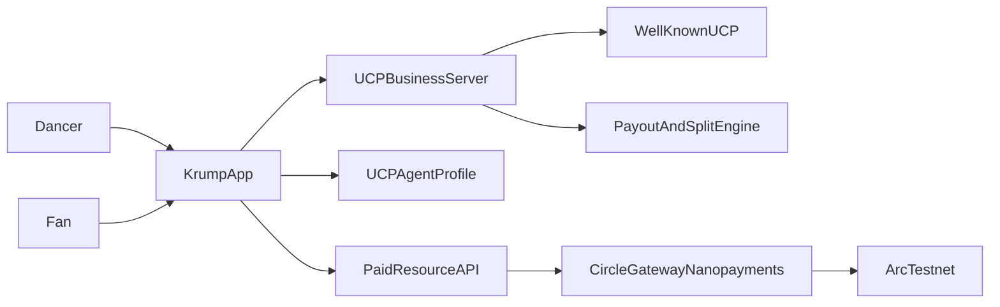

# Krump x UCP: 10 Use Cases with Ranking

## 1) Scoring Model

Each use case is scored on:

- Immediate Impact (0-10): how quickly it can help real dancers/organizers this season.
- Long-Term Financial Benefit (0-10): durable revenue potential for the Krump ecosystem over 1-3 years.
- Feasibility Signal: `High`, `Medium`, or `Low` for a hackathon MVP.

Tie-break rules:

1. Higher Immediate Impact wins for hackathon prioritization.
2. If tied, higher Feasibility wins (`High` > `Medium` > `Low`).
3. If still tied, higher Long-Term Financial Benefit wins.
4. If still tied, choose the concept with fewer legal/compliance dependencies.

## 2) Ten Krump Use Cases

### U1. Live Battle Micro-Tipping

- Concept: Audience tips dancers in real-time during battles (sub-cent to $5).
- UCP fit: Checkout capability standardizes payment session creation and completion.
- Arc + Circle fit: Circle Gateway nanopayments enables rapid gas-free micro-tips; Arc testnet for transparent payout ledger.
- Strengths: Immediate value, emotionally engaging, easy demo.
- Weaknesses: Requires clear anti-spam controls and event moderation.
- Immediate Impact: 10
- Long-Term Financial Benefit: 8
- Feasibility: High

### U2. Pay-Per-Move Tutorial Clips

- Concept: Users pay per short premium move breakdown (e.g., arm swing, chest pop, stomp variation).
- UCP fit: UCP can standardize paid content checkout and entitlement metadata.
- Arc + Circle fit: x402-style paid API/content gates with sub-cent pricing.
- Strengths: New creator monetization model and low buyer friction.
- Weaknesses: Needs reliable DRM-like access control and creator analytics.
- Immediate Impact: 9
- Long-Term Financial Benefit: 9
- Feasibility: High

### U3. Judge Feedback Marketplace

- Concept: Dancers purchase structured judge feedback packets after events.
- UCP fit: UCP order/update flows map to deliverable lifecycle (requested, in-progress, completed).
- Arc + Circle fit: Micro-escrow behavior with staged payout after delivery.
- Strengths: High skill development value and repeat transactions.
- Weaknesses: QC variability across judges; turnaround SLAs matter.
- Immediate Impact: 8
- Long-Term Financial Benefit: 8
- Feasibility: Medium

### U4. Crew Revenue Split Wallet

- Concept: One sale/tip auto-splits to crew members by predefined percentages.
- UCP fit: Payment handler + order records can map split metadata.
- Arc + Circle fit: Arc smart-contract split logic, Circle USDC settlement rails.
- Strengths: Solves common trust issues inside crews.
- Weaknesses: Governance disputes over split percentages.
- Immediate Impact: 8
- Long-Term Financial Benefit: 10
- Feasibility: Medium

### U5. Battle Entry + Instant Prize Pool Payout

- Concept: Participants pay entry fees; winners receive instant payouts post-judging.
- UCP fit: Standard checkout for ticketing and payout authorization evidence.
- Arc + Circle fit: Testnet settlement demo; production can migrate to mainnet-compatible flow.
- Strengths: Clear operations upgrade for organizers.
- Weaknesses: Legal/regulatory handling for pooled funds by region.
- Immediate Impact: 9
- Long-Term Financial Benefit: 8
- Feasibility: Medium

### U6. Pay-Per-Session Practice Room Booking

- Concept: Book studio/virtual practice rooms by minute with micro-billing.
- UCP fit: UCP checkout + order updates for session state.
- Arc + Circle fit: Nanopayment stream approximated through batched authorizations.
- Strengths: Strong fit for time-based pricing.
- Weaknesses: Requires accurate session metering and cancellation rules.
- Immediate Impact: 7
- Long-Term Financial Benefit: 8
- Feasibility: Medium

### U7. Krump Sample Pack Licensing

- Concept: Producers license Krump audio packs and battle chants using tiered micro-licenses.
- UCP fit: Capability extensions for digital rights metadata.
- Arc + Circle fit: Per-license settlement and creator split accounting.
- Strengths: New B2B lane between dance and music creators.
- Weaknesses: IP rights enforcement complexity.
- Immediate Impact: 6
- Long-Term Financial Benefit: 9
- Feasibility: Medium

### U8. Skill Challenges with Sponsor Bounties

- Concept: Sponsored weekly challenges pay micro-bounties for validated submissions.
- UCP fit: Standardized challenge purchase/funding and reward disbursement flow.
- Arc + Circle fit: USDC bounty pools and transparent payout traceability.
- Strengths: Great for community growth and brand collaboration.
- Weaknesses: Anti-fraud/content verification burden.
- Immediate Impact: 8
- Long-Term Financial Benefit: 9
- Feasibility: Medium

### U9. Krump DAO Community Grants

- Concept: Community treasury funds dance outreach, battles, and education mini-grants.
- UCP fit: Orders/payments can be represented as grant disbursement workflows.
- Arc + Circle fit: Onchain treasury policy and payout history.
- Strengths: Community ownership and long-term institution building.
- Weaknesses: Governance overhead and voter participation issues.
- Immediate Impact: 5
- Long-Term Financial Benefit: 9
- Feasibility: Low

### U10. Agent-Based Merch Concierge

- Concept: AI shopping agent sells crew merch and dance gear through UCP-compatible merchants.
- UCP fit: Native UCP discovery/checkout/order lifecycle.
- Arc + Circle fit: Circle-backed wallet funding and payouts to creators/affiliates.
- Strengths: High alignment with UCP's core commerce story.
- Weaknesses: Requires solid catalog integrations and fulfillment reliability.
- Immediate Impact: 7
- Long-Term Financial Benefit: 10
- Feasibility: Medium

## 3) Ranking

### Rank by Most Immediate Impact

1. U1 Live Battle Micro-Tipping (10)
2. U2 Pay-Per-Move Tutorial Clips (9)
3. U5 Battle Entry + Instant Prize Pool Payout (9)
4. U3 Judge Feedback Marketplace (8)
5. U4 Crew Revenue Split Wallet (8)
6. U8 Skill Challenges with Sponsor Bounties (8)
7. U6 Pay-Per-Session Practice Room Booking (7)
8. U10 Agent-Based Merch Concierge (7)
9. U7 Krump Sample Pack Licensing (6)
10. U9 Krump DAO Community Grants (5)

### Rank by Long-Term Financial Benefit

1. U4 Crew Revenue Split Wallet (10)
2. U10 Agent-Based Merch Concierge (10)
3. U2 Pay-Per-Move Tutorial Clips (9)
4. U7 Krump Sample Pack Licensing (9)
5. U8 Skill Challenges with Sponsor Bounties (9)
6. U9 Krump DAO Community Grants (9)
7. U1 Live Battle Micro-Tipping (8)
8. U3 Judge Feedback Marketplace (8)
9. U5 Battle Entry + Instant Prize Pool Payout (8)
10. U6 Pay-Per-Session Practice Room Booking (8)

## 4) Top 3 MVP Tracks for This Hackathon

### MVP A: Live Battle Micro-Tipping (U1)

- Why now: Maximum immediate wow + simple demo flow.
- Core flow: Viewer scans QR, signs gas-free micropayment authorization, dancer balance updates live.
- Demo proof points:
  - 3 tips from 3 wallets
  - real-time leaderboard
  - payout statement per dancer

### MVP B: Pay-Per-Move Tutorial Clips (U2)

- Why now: Strong creator economy story with repeatable micro-revenue.
- Core flow: User requests premium clip, receives payment-required response, pays, unlocks content.
- Demo proof points:
  - locked vs unlocked endpoint
  - sub-cent payment success
  - creator earnings dashboard

### MVP C: Battle Entry + Prize Payout (U5)

- Why now: Judges understand it instantly and it is operationally practical.
- Core flow: registration checkout, roster lock, winner settlement.
- Demo proof points:
  - 4 entrants checkout
  - bracket result update
  - instant winner payout action

## 5) Architecture Snapshot

## 6) Partner Prize Fit Notes

- UCP track narrative: interoperable commerce primitives for creator and event ecosystems.
- Circle narrative: gas-free USDC nanopayments + batched settlement for high-frequency low-value transactions.
- Arc narrative: testnet-native chain execution for transparent programmable settlement and payout logic.
