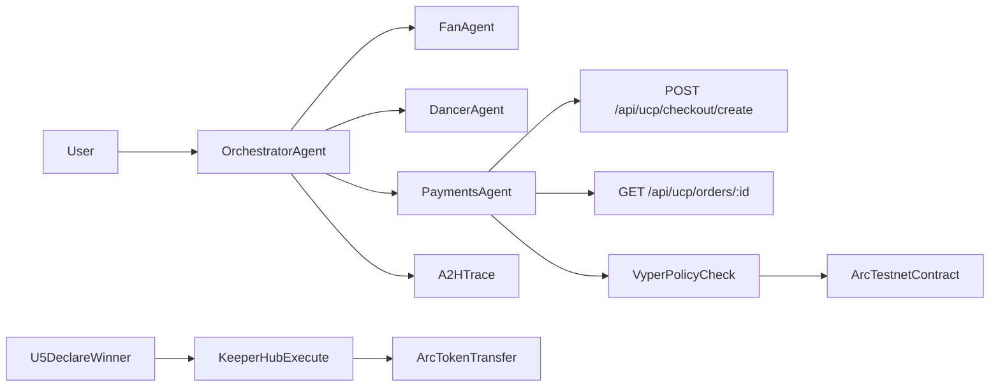

# Krump Protocol Agents - Pitch Deck

## Slide 1 - Title

**Krump Protocol Agents**  
Human to Agent. Agent to Agent. Agent to Human.  
UCP at the core, Vyper credibility on Arc.

Speaker note: We built an agent-native commerce system where AI coordination and protocol-compliant payments work together in one demo-ready stack.

---

## Slide 2 - The Problem

- Creator payments are fragmented and opaque.
- Agent demos usually skip payment reliability.
- Payment demos usually skip autonomous coordination.
- Judges need both novelty and execution proof.

Speaker note: Existing solutions force a tradeoff between agent intelligence and payment trust. We remove that tradeoff.

---

## Slide 3 - Our Solution

- UCP-native commerce backend for standardized checkout + order flows.
- Agent orchestration layer for H2A, A2A, A2H.
- Vyper settlement policy for enforcement credibility.
- Circle + Arc rails for practical payment operations.
- **KeeperHub** (ETHGlobal OpenAgents sponsor): dual execution mode — local Arc and online testnet mode via Arc USDC CCTP bridge (Ethereum Sepolia, Base Sepolia, Polygon Amoy, Arbitrum Sepolia, Avalanche Fuji).

Speaker note: We did not replace standards. We composed them, then layered sponsor-grade execution where it helps.

---

## Slide 4 - Product Experience

In one interface, users can:

- Trigger agent intents (`tip_dancer`, `unlock_clip`, `battle_entry`)
- Inspect live orchestration traces
- Run settlement policy checks
- View UCP discovery/conformance outputs
- Execute the top 6 use cases with selectable payment rails (`metamask`, `circle_wallet`, `offchain_demo`)
- KeeperHub operator panel now includes one-click `Refresh balances` and explicit destination signer source + wallet-id hints

Speaker note: Every action is explainable and auditable in real time.

---

## Slide 5 - Architecture

Speaker note: Payments agent is the constrained executor; UCP remains the contract for commerce semantics. KeeperHub is the optional reliability layer when we push the prize pool on-chain.

---

## Slide 6 - Credibility Proof

- Vyper settlement contract deployed on Arc testnet.
- Deployment tx and contract address documented.
- Runtime enforcement enabled by default in demo baseline.
- Titanoboa tests passing.

Speaker note: This is not mock-only logic. We have chain-backed evidence plus deterministic local verification.

---

## Slide 7 - Why We Win

- Strong standards alignment: UCP-centric design.
- Clear agent narrative: H2A, A2A, A2H fully demonstrated.
- Practical fallback strategy: disable enforcement switch for resilience.
- End-to-end shipped with docs, tests, and Git history.

Speaker note: We optimized for both innovation and reliability under hackathon constraints.

---

## Slide 8 - Live Demo Script (2-3 min)

1. Show `GET /api/agents/capabilities` — settlement mode + `keeperhub_execution` when configured.
2. Show `GET /api/agents/identity` (ERC-8004 style metadata).
3. Run `tip_dancer` agent session.
4. Highlight trace events and settlement proof.
5. Trigger one payment flow with MetaMask and one with Circle (all payment-bearing flows support live rail selection in UI).
6. Show UCP checkout/order endpoints.
7. **KeeperHub:** show local vs online mode on demo transfer, then run one online execution path (Arc -> CCTP -> target testnet transfer).
8. Show signer-source clarity in action (`destination wallet` vs fallback) and wallet-id match hints on at least two target chains.
9. Show Arc deployment proof in README.

Speaker note: Keep pace fast. Focus on trust signals, standards, and one crisp sponsor story (KeeperHub executes; UCP decides commerce shape).

---

## Slide 9 - Business / Ecosystem Potential

- Agent-native creator marketplaces
- Autonomous payment assistants
- Protocol-compliant commerce agents for wallets/exchanges
- B2B orchestration middleware for multi-agent payment ops

Speaker note: This can evolve from demo to infrastructure.

---

## Slide 10 - Ask

We are looking for:

- Ecosystem partners for ERC-8004 identity registry integration
- Wallet/channel integrations for wider H2A entry points
- Pilot creators and payment platforms for real-world validation

Speaker note: We already have the core stack. Next is distribution and integrations.

---

## Backup Slide - Technical References

- UCP endpoints in `src/server.js`
- Agent orchestration in `src/agents/orchestrator.js`
- KeeperHub client in `src/keeperhub/client.js`; routes `/api/keeperhub/*` and `execute_via_keeperhub` on declare-winner in `src/server.js`
- KeeperHub UI controls and signer hints in `public/main.js` + `public/index.html`
- Vyper contract in `contracts/AgentSettlementPolicy.vy`
- Tests in `tests/titanoboa/test_agent_settlement_policy.py`
- Deployment helper in `scripts/deploy_vyper_policy.py`
- Marketing one-pager: `docs/lovable-landing-page.md`; Lovable rebuild spec: `docs/lovable-mega-prompt.md`
